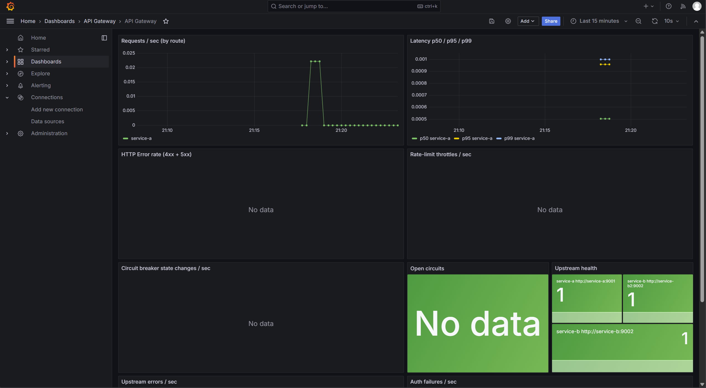

# api-gateway

A small, fast API gateway written in Go. Reverse proxy, JWT auth, token-bucket rate limiting (local + Redis), round-robin load balancing, Prometheus metrics, structured JSON logging — all driven by a single YAML config.

Built as a learning / portfolio project. Mini Kong, minus the plugins.

## Quickstart

Requires: Docker, Docker Compose v2, Go 1.22+ (for local runs).

```bash
# Bring up gateway + Redis + 2 demo backends + Prometheus + Grafana
make compose-up

# In another shell — mint a JWT and hit a protected route
export JWT_SECRET=dev-secret-change-me
TOKEN=$(go run ./scripts/gen-jwt.go -sub alice -secret "$JWT_SECRET")

curl -s http://localhost:8080/healthz
curl -s -H "Authorization: Bearer $TOKEN" http://localhost:8080/a/ping
curl -s http://localhost:8080/b/ping      # no auth required on /b/
```

Prometheus: http://localhost:9091 — Grafana: http://localhost:3000 (admin/admin).

## Dashboard



## Features (phase 1)

- HTTP reverse proxy with per-route upstream pools
- Round-robin load balancing
- JWT auth middleware (HS256 + RS256), per-route `required | optional | none`
- Token-bucket rate limiting — in-process (`x/time/rate`) or distributed (Redis + Lua), keyed by IP / sub / API key
- `/healthz` + `/readyz`
- Prometheus metrics on `:9090/metrics`
- Structured JSON logs with request ID propagation
- YAML config with SIGHUP hot-reload
- Docker Compose stack with Prometheus + Grafana pre-provisioned

## Roadmap (phase 2)

Sliding-window limiter, circuit breaker, response cache, PostgreSQL-backed dynamic config, OAuth2 (Keycloak), gRPC, OpenTelemetry/Jaeger, weighted + least-connections LB, admin UI.

## Architecture

```
           ┌────────────────────────────────────────────┐
client ──▶ │  recover → req-id → log → metrics → auth → │ ──▶ upstream pool
           │  ratelimit → proxy (Director/ErrorHandler) │     (round-robin)
           └────────────────────────────────────────────┘
                         │                │
                         ▼                ▼
                    Prometheus        Redis (rate state)
```

## Config

See [configs/gateway.yaml](configs/gateway.yaml). Env vars override `${VAR}` placeholders.

## Development

```bash
make build       # compile to ./bin/gateway
make run         # run locally (needs Redis for distributed mode)
make test        # race-enabled unit tests
make lint        # golangci-lint
```

MIT license.
